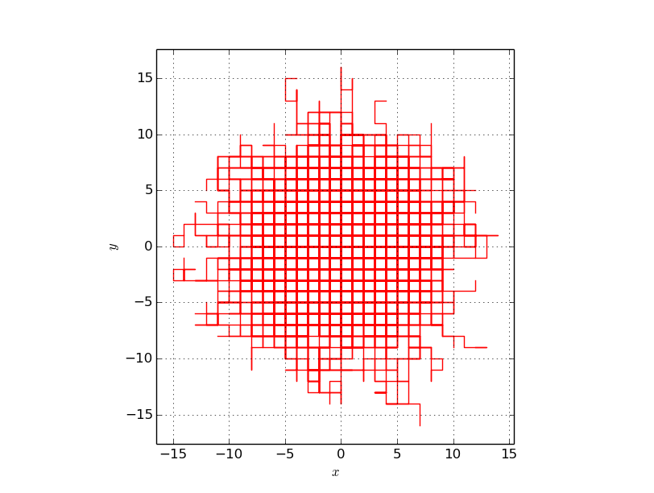
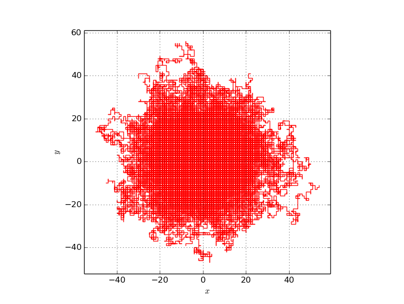
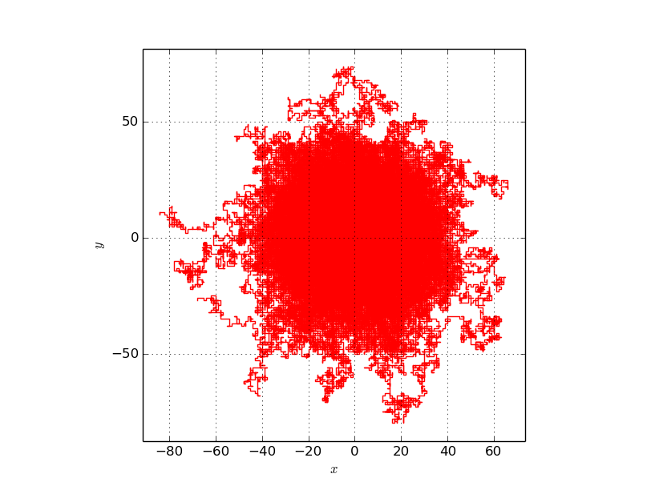
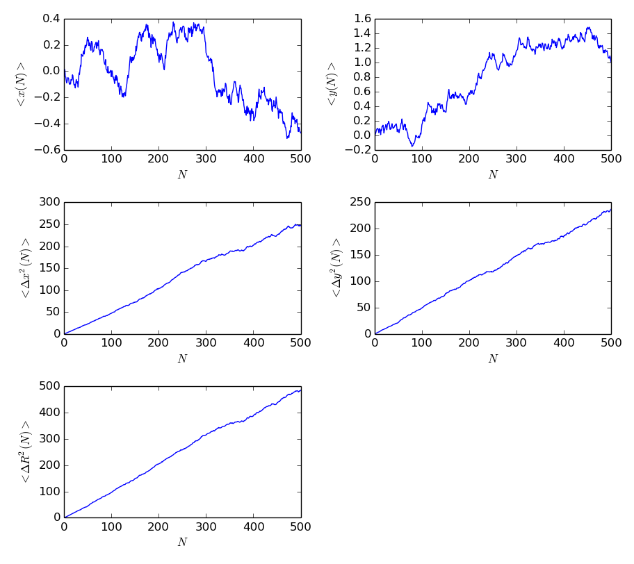

.. _12-2-label:

===============================================================================
問題12.2 - 2次元のランダムウォーク
===============================================================================

.. contents::

シミュレーションの目的
============================

2次元格子状を互いに独立に動く多数の粒子を考える。初期状態として、正方格子の原点にランダムウォークをする粒子の集団を置いて、どの粒子も、各分割時間ごとに等しい確率で可能な4方向のいずれかにランダムに移動するとして、粒子の訪れた位置を記録する。

作成したプログラム
=============================

本シミュレーションで作成したプログラムを以下に示す。

* ダイアログを表示するプログラム( :download:`MyDialog.py <MyDialog.py>` )

このプログラムでは、引数として与える文字列のリストと辞書\{ 文字列:コマンド\}のリストから、テキストとボタンを作成し、ボタンを押すと指定したコマンドを実行するようなダイアログを表示する。

.. literalinclude:: MyDialog.py
    :language: python
    :linenos:

* 2次元ランダムウォークのシミュレーション( :download:`12-2_random_walk_d2.py <12-2_random_walk_d2.py>` )

2次元ランダムウォークのシミュレーションを行うプログラム。モジュールMyDialogを用いて、figureボタンを押すとnwalkers個の粒子の2次元ランダムウォークの軌跡が表示され、graphボタンを押すと\ :math:`<x(N)>`\ ,\ :math:`<y(N)>`\ ,\ :math:`<\Delta x^{2}(N)>`\ ,\ :math:`<\Delta y^{2}(N)>`\ ,\ :math:`<\Delta R^{2}(N)> = <x^{2}(N)> + <y^{2}(N)> -<x(N)>^{2} -<y(N)>^{2}`\ の値を、Nに対してプロットする。Quitボタンを押すと、プログラムを終了する。各関数の説明をすると、まず、random_walk_d2はNのリストとnwalkersの値から、xとyの配列を作成し、乱数の値の大きさに応じて次の要素の値を更新していく。こうして得られた配列を元に、calcでは\ :math:`<x(N)>`\ ,\ :math:`<y(N)>`\ ,\ :math:`<x^{2}(N)>`\ ,\ :math:`<y^{2}(N)>`\ ,\ :math:`<\Delta x^{2}(N)>`\ ,\ :math:`<\Delta y^{2}(N)>`\ ,\ :math:`<\Delta R^{2}(N)>`\ の値を計算する。draw_figureでは、xとyの配列のデータをそのまま用いて、2次元平面上にその軌跡をプロットする。このとき、毎回plt.plotを呼び出すのではなく、set_dataメソッドを用いて描画を行うことによって処理を軽くしている。plot_graphではcalcで計算した値を用いてそれぞれの量をNに対してプロットする。

.. literalinclude:: 12-2_random_walk_d2.py
    :language: python
    :linenos:

実習課題
=====================

a. 粒子数を\ :math:`\mathrm{nwalkers} \geq 200`\ 、各粒子のステップ数を\ :math:`N \geq 500`\ にとり、プログラムを実行せよ。各粒子が一匹の蜂を表していると考えたときに、蜂の群れの形の定性的な性質について述べよ。群れの境界の定性的な性質を\ :math:`N`\ の関数として説明せよ。境界はギザギザしているか。それとも滑らかか。
 
プログラム_12-2_random_walk_d2.pyを用いて2次元ランダムウォークのシミュレーションを行い(\ :math:`\mathrm{nwalkers}=500`\ )、その結果を\ :num:`図#fig-12-2-f1`\ 、\ :num:`図#fig-12-2-f2`\ 、\ :num:`図#fig-12-2-f3`\ に示す。これらの図を比較して分かることとして、\ :math:`N`\ の量を増大させたとき、ランダムウォークによって形作られる境界はギザギザしている。すなわち、回転半径のようなものを考えたとき、その円周の長さに比べて境界の長さがより大きくなることが分かる。また、各粒子が一匹の蜂を表していると考えたときに、蜂の群れの形は、ある時間の間の観察の結果を重ねて書くと円形に近くなっており、観察する時間を長くすると(つまりステップ数を大きくすると)、境界はギザギザしているように見える。

.. _fig-12-2-f1:

    
    2次元ランダムウォークのシミュレーション結果(N=50)

.. _fig-12-2-f2:

    
    2次元ランダムウォークのシミュレーション結果(N=500)

.. _fig-12-2-f3:

    
    2次元ランダムウォークのシミュレーション結果(N=1000)

b. 量\ :math:`<x(N)>`\ ,\ :math:`<y(N)>`\ ,\ :math:`<\Delta x^{2}(N)>`\ ,\ :math:`<\Delta y^{2}(N)>`\ を\ :math:`N`\ の関数として求めよ。平均はすべての粒子について行う。また、\ :math:`<\Delta R^{2}(N)> = <x^{2}(N)> + <y^{2}(N)> -<x(N)>^{2} -<y(N)>^{2}`\ で与えられる平均2乗変位\ :math:`<\Delta R^{2}(N)>`\ を求めよ。各量の\ :math:`N`\ 依存性はどうなるか。

:math:`<x(N)>`\ ,\ :math:`<y(N)>`\ ,\ :math:`<\Delta x^{2}(N)>`\ ,\ :math:`<\Delta y^{2}(N)>`\ ,\ :math:`<\Delta R^{2}(N)>`\ を、ステップ数Nに対してそれぞれ計算を行い(\ :math:`\mathrm{nwalkers}=500`\ )、得られた結果をグラフにまとめたものを\ :num:`図#fig-12-2-f4`\ に示した。このグラフから読み取れるように、\ :math:`<x(N)>`\ ,\ :math:`<y(N)>`\ はほぼ零であり、Nの依存性はない。これは1次元の場合と同じである。また、Nが小さいところでは0に非常に近くなっているのに対して、Nが大きくなるとばらつきが生まれるのは、\ :ref:`問題12.1 <12-1-label>`\ で考えたように、同じ精度で求めるためにはNが大きいときには試行回数を増やす必要があったことを思い出せばよい。次に、\ :math:`<\Delta x^{2}(N)>`\ , \ :math:`<\Delta y^{2}(N)>`\ についてであるが、これらは\ :math:`N`\ に比例しており、その比例係数はおよそ\ :math:`1/2`\ であることが分かる。これは2次元のランダムウォークにおいて、x方向に進む確率\ :math:`r(=1/2)`\ 、右に進む確率\ :math:`p(=1/2)`\ 、左に進む確率\ :math:`q(=1/2)`\ とすると

.. math:: <\Delta x^{2}(N)> = 4pqrl^{2}N = 4 \times \frac{1}{2} \times \frac{1}{2} \times \frac{1}{2} \times 1^{2}N = \frac{1}{2}N

となることと一致している。この\ :math:`r`\ は、\ :math:`N`\ 回のステップのうち、\ :math:`N`\ が非常に大きいときには、\ :math:`rN`\ 回が\ :math:`x`\ 軸方向の移動に充てられるようにみなせることと対応している。最後に\ :math:`<\Delta R^{2}(N)>`\ は、\ :math:`<\Delta x^{2}(N)>`\ と\ :math:`<\Delta y^{2}(N)>`\ の和であるので、\ :math:`N`\ に比例して、その傾きは1である。

.. _fig-12-2-f4:

    
    \ :math:`<x(N)>`\ ,\ :math:`<y(N)>`\ ,\ :math:`<\Delta x^{2}(N)>`\ ,\ :math:`<\Delta y^{2}(N)>`\ ,\ :math:`<\Delta R^{2}(N)>`\ のN依存性のグラフ

まとめ
=======================

2次元の単純なランダムウォークのシミュレーションと、そこで見られるNと平均・分散・平均2乗変位について成り立つ関係について調べることができた。

参考文献
============================

* ハーベイ・ゴールド,ジャン・トボチニク,石川正勝・宮島佐介訳『計算物理学入門』,ピアソン・エデュケーション, 2000.

